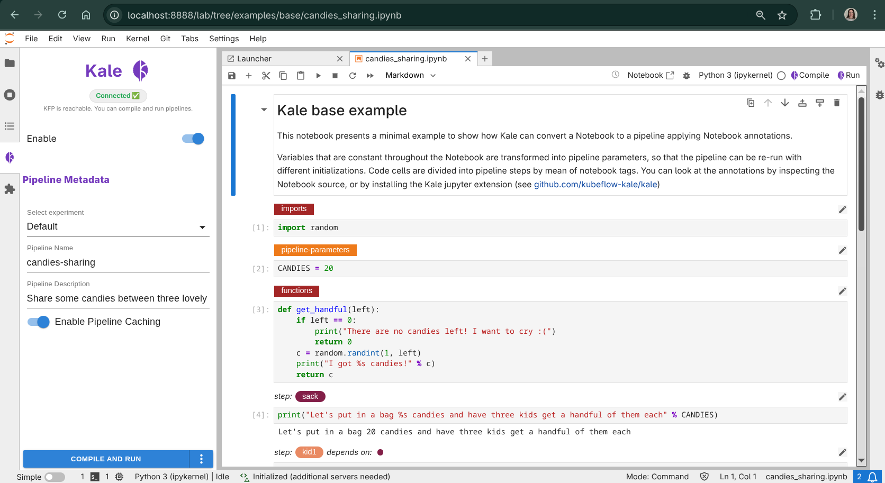
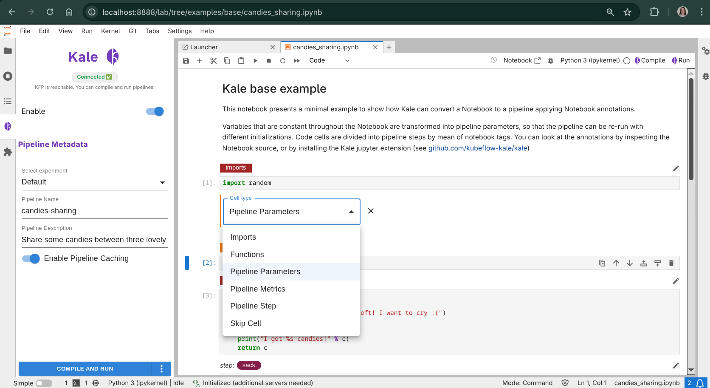
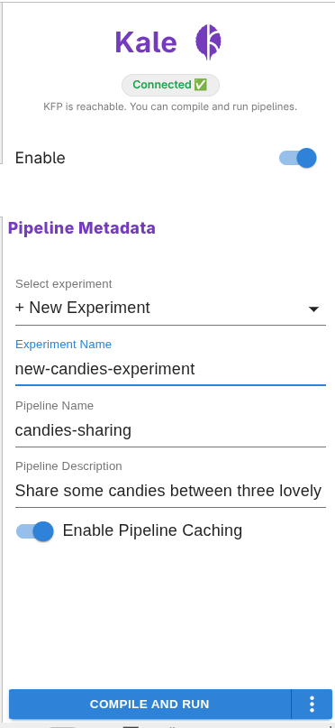
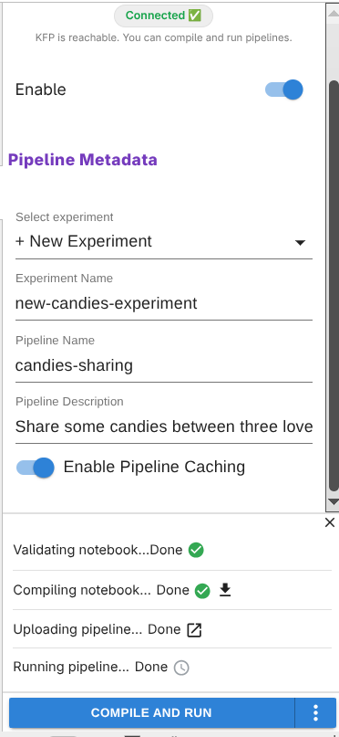

# Quickstart

This walk-through takes you from a stock Kale install to a running pipeline
on Kubeflow Pipelines in under ten minutes, using the `candies_sharing`
example that ships with the repository.

The recommended path is the **JupyterLab UI**: you annotate cells, compile,
and submit the pipeline without ever leaving the notebook. If you'd rather
drive Kale from a terminal, the [CLI flow](#advanced-cli-flow) at the bottom
of this page covers the same journey.

## Prerequisites

Before you start, make sure you have:

- Kale installed, including the JupyterLab extension (see [Installation](installation.md)).
- A running Kubernetes cluster with Kubeflow Pipelines v2.16.0+ deployed.
- The KFP API reachable on `http://127.0.0.1:8080` — for a minikube setup you
  can run:
  ```bash
  kubectl port-forward -n kubeflow svc/ml-pipeline-ui 8080:80
  ```

## 1. Launch JupyterLab with Kale

From the repository root, start the bundled JupyterLab environment:

```bash
make jupyter
```

Then open `examples/base/candies_sharing.ipynb` from the file browser. The
notebook defines a toy pipeline that demonstrates every Kale concept in the
minimum amount of code, and it ships already annotated with Kale tags.


## 2. Open the Kale side panel

Click the Kale icon in the JupyterLab left sidebar to toggle the Kale
Deployment Panel. This is the control surface you'll use for the rest of the
quickstart: it inspects cell tags, compiles the notebook, and submits runs
to Kubeflow Pipelines.



## 3. Review the cell tags

Each cell now has a dropdown showing its Kale cell type. The
`candies_sharing` notebook uses most of Kale's core tag types:

- **Imports** — all `import` statements go here. Kale prepends this cell to
  every step in the pipeline.
- **Pipeline Parameters** — defines values that will become KFP parameters,
  tweakable at submission time.
- **Step** — one or more named steps, each with optional dependencies on
  earlier steps (declared via `prev:<step_name>`).



See [Cell Types & Annotations](../concepts/cell-types.md) for the full tag vocabulary.

## 4. Configure the pipeline metadata

In the Kale side panel, confirm the basics:

- **Pipeline name** — defaults to the notebook filename.
- **Experiment** — defaults to `Default` (or the first available KFP
  experiment).



## 5. Compile and run from the panel

Click **Compile and Run** at the bottom of the Kale panel. Kale will, in
order:

1. Parse the notebook and extract the Kale tags from cell metadata.
2. Build a pipeline DAG (Directed Acyclic Graph) from the `step` and `prev:` annotations.
3. Detect which variables need to flow between steps.
4. Generate a KFP v2 DSL Python script under `.kale/`.
5. Upload the pipeline to KFP and start a new run in the selected experiment.

Each phase updates in place in the panel, with a link to the generated
`.kale/<notebook>.kale.py` once it exists.



## 6. Watch the run in the KFP UI

When the upload finishes, the panel shows a **View run** link pointing at
the Kubeflow Pipelines UI. Follow it to watch the DAG execute step-by-step;
click any step to see its logs, artifacts, and the data Kale marshalled in
and out of it.


## What's next?

- Learn how Kale detects and moves data between steps in
  [Data Passing & Marshalling](../concepts/data-passing.md).
- Explore the rest of the panel (volumes, snapshots, parameters) in
  [Running Pipelines](../user-guide/running-pipelines.md).
- Browse the [examples](https://github.com/kubeflow/kale/tree/main/examples) gallery for more realistic pipelines.

---

## Advanced: CLI flow

If you'd rather drive Kale from a terminal — for example in CI, on a remote
box without a JupyterLab install, or when scripting multi-notebook builds —
you can do the same thing with the `kale` CLI.

### Compile the notebook

```bash
kale --nb examples/base/candies_sharing.ipynb
```

Look inside the `.kale/` directory that was just created:

```bash
ls .kale/
# candies_sharing.kale.py     ← generated KFP v2 DSL
```

Open `candies_sharing.kale.py` — you'll see one `@kfp_dsl.component` function
per step, a `@kfp_dsl.pipeline` function wiring them together, and a
`__main__` block that you can run directly to compile the pipeline to YAML.

### Compile and submit in one step

Add `--run_pipeline` to compile **and** submit the pipeline to KFP in one
shot:

```bash
kale --nb examples/base/candies_sharing.ipynb \
     --kfp_host http://127.0.0.1:8080 \
     --run_pipeline
```

This uploads the pipeline, creates an experiment (default:
`Kale-Pipeline-Experiment`), and starts a run. Open the KFP UI at
<http://127.0.0.1:8080> and navigate to **Runs** to watch it execute.

See [CLI Reference](../api/cli.md) for the complete CLI reference.
